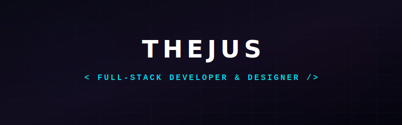

<p align="center">
  
</p>

<h1 align="center">
Hi 👋 I'm <b>Thejus</b>
</h1>

<h3 align="center">
☁️ Cloud Engineer • 🤖 AI Builder • 💻 Full-Stack Developer • 🎨 UI Designer
</h3>

<p align="center">
Building scalable cloud infrastructure, AI-powered applications, and premium digital experiences.
</p>

<p align="center">

<a href="https://www.linkedin.com/in/YOUR-LINKEDIN">

</a>

<a href="https://pixelmind-co.vercel.app">

</a>

<a href="mailto:YOURMAIL@gmail.com">

</a>


</p>

---

# 🚀 About Me

```yaml
Name: Thejus

Role:
  Cloud Engineer
  AI Developer
  Full-Stack Developer

Current Focus:
  - AWS Cloud Architecture
  - Kubernetes & Docker
  - Terraform Automation
  - AI Agents
  - Modern Web Applications

Currently Learning:
  - Advanced Kubernetes
  - Agentic AI
  - Distributed Systems

Open For:
  - Freelance Projects
  - Cloud Engineering
  - AI Development
```

---

# ⚡ Tech Arsenal

### ☁️ Cloud

<p>


</p>

---

### 💻 Programming

<p>


</p>

---

### 🌐 Frontend

<p>


</p>

---

### ⚙ Backend

<p>


</p>

---

### 🤖 AI

- OpenAI API
- Claude API
- LangChain
- RAG
- Prompt Engineering
- AI Agents

---

# 🏆 Featured Projects

## 🚀 PixelMind

Premium AI & Automation Agency

- Modern UI
- AI Automation
- Cloud Deployment

---

## ☁️ AWS Secure Infrastructure

- EC2
- VPC
- ALB
- IAM
- WAF
- RDS
- S3
- Terraform
- GitHub Actions

---

## 🤖 Agentic SRE Assistant

LLM-powered infrastructure troubleshooting assistant using

- Claude
- LangChain
- RAG
- Vector Database

---

## 🏗 Embark

Luxury Architecture Website

- Next.js
- Framer Motion
- GSAP
- Premium UI

---

# 📊 GitHub Analytics

<p align="center">


</p>

<p align="center">


</p>

---

# 📈 Contribution Graph

<p align="center">


</p>

---

# 🛠 Tools I Use

<p align="center">


</p>

---

# 💡 Philosophy

> **Build clean systems.**
>
> **Automate repetitive work.**
>
> **Design experiences people remember.**

---

<p align="center">


</p>
